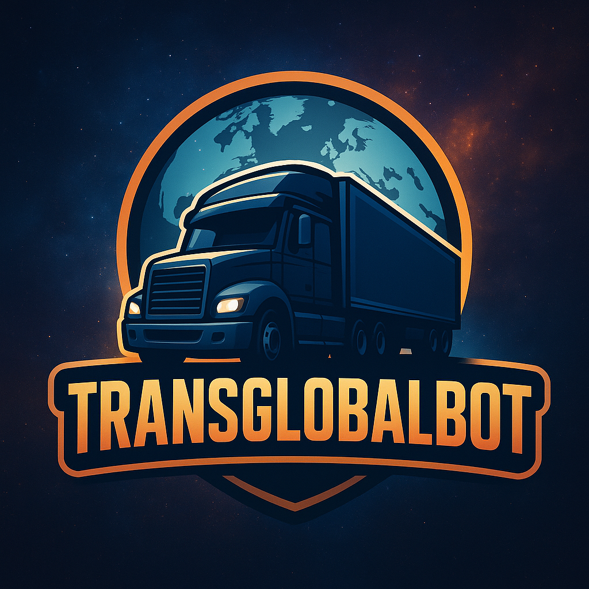

# TransGlobalBOT – Legal & Trust Center

Welcome to the official Legal & Trust Center for **TransGlobalBOT**, a professional Discord assistant for VTC communities in **Euro Truck Simulator 2** and **American Truck Simulator**. Our mission is to deliver reliable convoy coordination, event tooling, and driver connectivity—while keeping privacy, compliance, and transparency at the core of our design.

---

## Key Commitments
- **Compliance-first**: We align with Discord’s Terms, the GDPR, and applicable platform rules.
- **Data minimization**: We only process what is necessary to power commands and features.
- **Transparency**: Our policies are written in plain English and updated when functionality changes.
- **User control**: Server owners decide which features are enabled; users can request access/deletion where applicable.
- **Security by default**: Secrets are protected; traffic is encrypted in transit; access is least-privilege.

> Looking for the formal documents? Head to: **[Terms of Service](terms.md)** • **[Privacy Policy](privacy.md)**

---

## Privacy at a Glance
**What we process (by default):**
- Discord **server ID**, **channel ID**, **role IDs** needed for configuration  
- Discord **user ID** and **username** only as required by commands  
- **Command payloads** and ephemeral operational logs (short-lived)  
- **No sale** of personal data. **No advertising profiles.**

**Why we process it:**
- To execute slash commands, manage convoys, track events, and maintain feature configuration
- To protect the service against abuse, spam, and fraud
- To deliver optional VTC features explicitly enabled by server owners

**How long we keep it:**
- Operational logs: short retention for troubleshooting, then deletion
- Configuration data: retained while the bot remains in your server or until removed by the owner

See **[Privacy Policy](privacy.md)** for details, legal bases, and your rights.

---

## Security Overview
- **Transport security**: All dashboards and webhooks (if enabled) use HTTPS/TLS.
- **Secrets management**: No hard-coded tokens in code repositories; secrets are rotated.
- **Least privilege**: Scopes and permissions are restricted to what features require.
- **Abuse prevention**: Rate-limiting and anomaly detection guard stability and fairness.
- **Continuity**: Regular backups of configuration data (if applicable) and documented recovery procedures.

> If you believe you have found a security issue, please contact us (see Privacy Policy). Responsible disclosure is welcome.

---

## For VTC Owners & Admins
- Review **[Terms of Service](terms.md)** to understand responsibilities and acceptable use.
- Check **[Privacy Policy](privacy.md)** to learn what’s processed and how to honor user rights.
- Limit the bot’s permissions to the features you use; rotate roles/tokens periodically.
- Communicate your own server rules—TransGlobalBOT complements (not replaces) your policies.

---

_Last updated: August 21, 2025_
